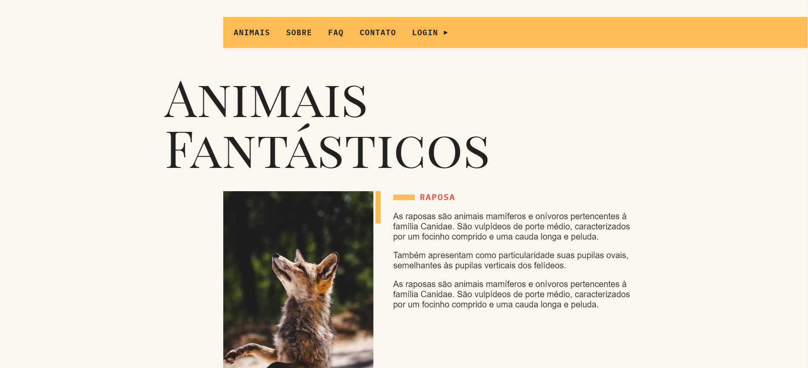

# Animais Fantásticos([Click Here](https://github.com/Netinhoalves/animais-fantasticos))

## SOBRE ESTE PROJETO!

Animais Fantásticos é um projeto desenvolvido como um desafio proposto pelo [André Rafael](https://www.youtube.com/origamid), no final do curso ["JavaScript Completo ES6"](https://www.origamid.com/curso/javascript-completo-es6). Durante o curso, aprendi muito sobre tecnologias web e pude aplicar esses conhecimentos em outros projetos.

## Objetivo
O objetivo do projeto é criar um website informátivo sobre alguns animais da natureza.

## Tecnologias usadas

* HTML5
* CSS3
* FlexBox
* CSS Grid Layout
* Media-queries
* Layout Responsivo
* Javascript

## Acessar minha resolução

   Eu hospedei este desafio com a ajuda da [Vercel](https://vercel.com/), para acessar minha resolução deste desafio [Clique Aqui](#)